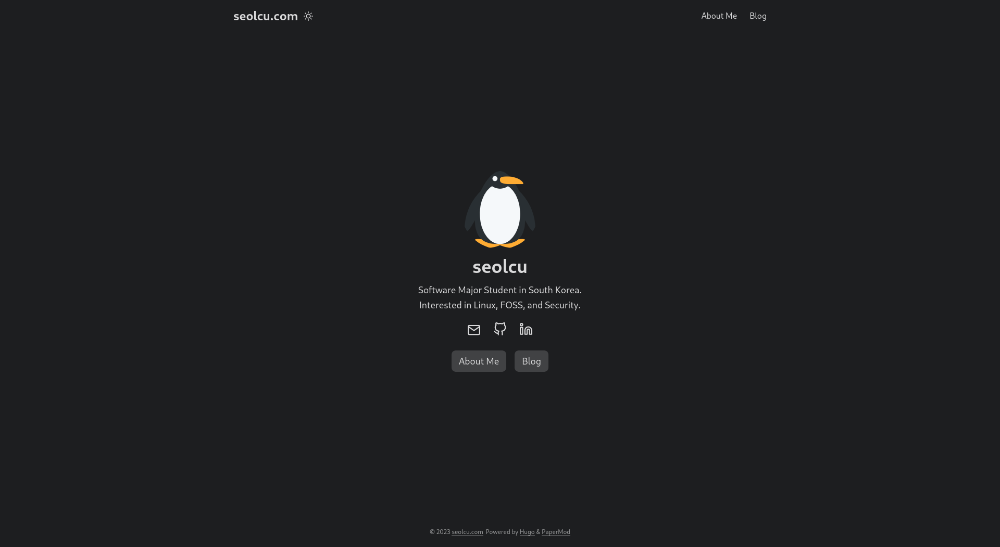
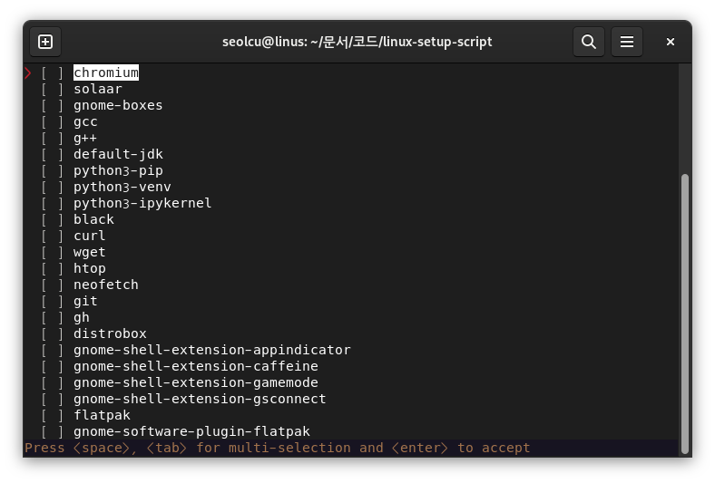
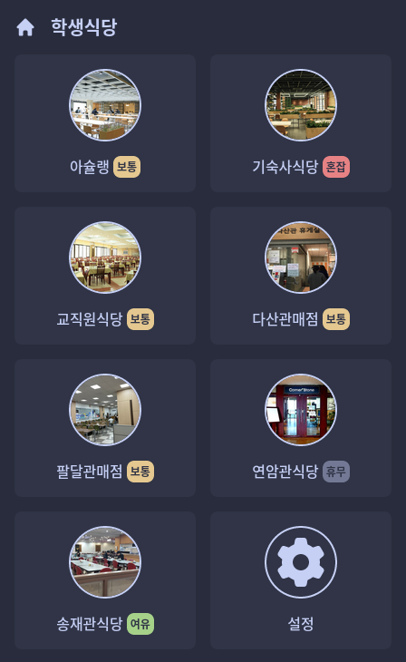
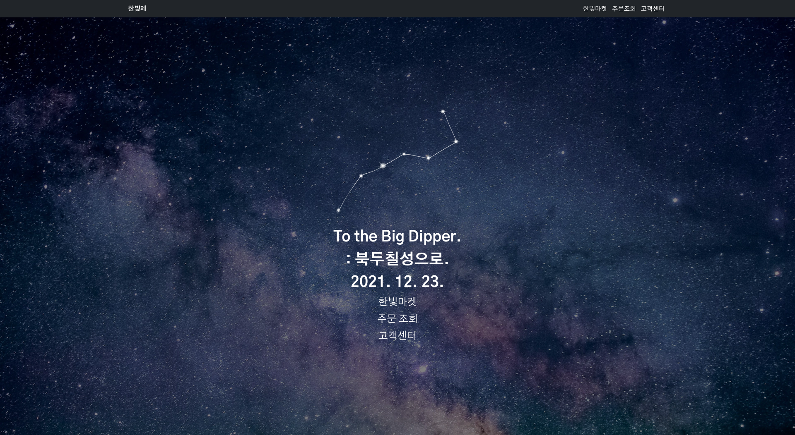

+++
title = 'About Me'
draft = false
+++



Welcome! My name is **Gyuwon Seol**, and I am a sophomore at the Ajou University, majoring in Software Engineering.
I live in South Korea.

- I can code in `python`, `JavaScript`, `C`, and `bash`.
- I am familiar with `React`, `Linux`, and `Git`.
- I am interested in `System Hacking`, `Linux Desktop Environments`, `Homelab`, and `Privacy`.

> _BTW, I use Debian Testing with GNOME as my daily driver._

## My Projects

### seolcu.com (2023-12-29 ~ )

[Github Repository](https://github.com/seolcu/seolcu.com)

My personal website that you are currently visiting.

It is built with [Hugo](https://gohugo.io/) and [PaperMod Theme](https://github.com/adityatelange/hugo-PaperMod).

### linux-setup-script (2023-07-14 ~ )

[Github Repository](https://github.com/seolcu/linux-setup-script)

My personal Linux setup script for Debian, Arch, and NixOS.
Designed only for my personal use, but you can use it if you want.

It is built with [python](https://www.python.org/).

### ajou-cafeteria (2023-11-15 ~ 2023-12-04)

[Link to the website](https://ajou-cafeteria.vercel.app)

[Github Repository](https://github.com/seolcu/ajou-cafeteria)

A simple prototype PWA that provides information about Ajou University's cafeterias.
It was supposed to provide information about:

- Today's menu
- Ingredients of the menu
- Price of the menu
- Cafeteria's operating hours
- Crowdedness of the cafeterias

Since it is a prototype, it **does not provide the real information.**

This project was made for the AI Introduction course at Ajou University.

It is built with [React](https://react.dev), [Vite](https://vitejs.dev/) and [Tailwind CSS](https://tailwindcss.com/).

### hanbit27 (2021-09-01 ~ 2021-12-23)

[Link to the website](https://hanbit27.vercel.app/)

[Github Repository](https://github.com/seolcu/hanbit27)

A shopping mall website officially used for the 27th festival of the GwangyangJecheol High School.
Since the festival is over, the website no longer shows the products.

It is built with [Next.js](https://nextjs.org/), [Bootstrap](https://getbootstrap.com/), and [Firebase](https://firebase.google.com/).

### zzapgo-life (2021-03-01 ~ 2021-10-31)



[Link to the website](https://zzapgo-life.vercel.app/)

[Github Repository](https://github.com/seolcu/zzapgo-life)

A PWA that provides information about the GwangyangJecheol High School.
It provides information about:

- Today's menu
- Link to the school's various websites

This project was made in place of the service, [zego.life by JedBeom](https://github.com/JedBeom/zego.life), which was discontinued.

It is built with [React](https://react.dev), [Vite](https://vitejs.dev/), and [Chakra UI](https://chakra-ui.com/).

### Etc.

You can find my other projects on my [Github profile](https://github.com/seolcu).
