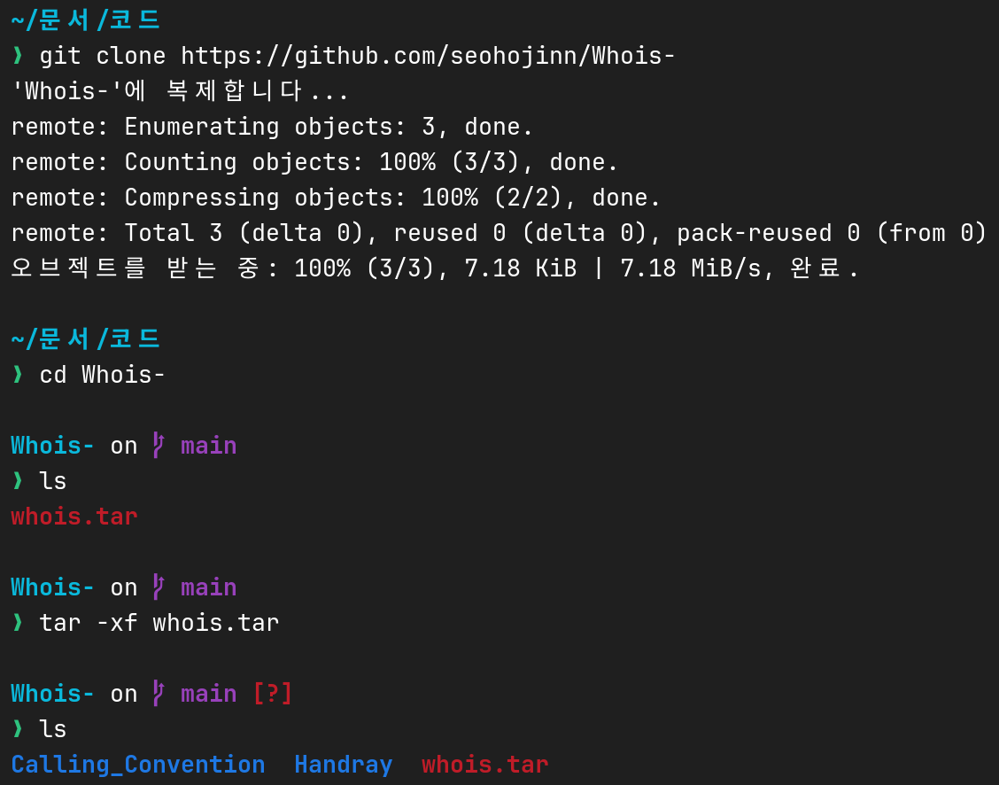

Bash is a powerful shell scripting language that is widely used on Linux and other Unix-like operating systems.
It is very useful for automating tasks and writing small programs.
In this article, we will discuss the basics of Bash scripting and how to get started with it.

# What is Bash?

BASH (Bourne Again SHell) is a shell and command language interpreter for Linux and other Unix-like operating systems.
It is the default shell for most Linux distributions and is also available on other Unix-like operating systems.
Since it is a shell, it is used to execute commands and scripts.
It is also a programming language, which means that you can write scripts to automate tasks and write small programs.

# Writing your first Bash script

## `.sh` file extension

Bash scripts are usually saved with the `.sh` file extension.
This is not a strict requirement, but it is a common convention to use this file extension for Bash scripts.
For example, you can save your script as `myscript.sh`.

## Shebang(`#!`)

The first line of a Bash script should start with a shebang(`#!`) followed by the path to the Bash interpreter.
This tells the system that the file is a script and should be executed using the specified interpreter.
The name shebang comes from the `#`(hash) and `!`(bang) characters at the beginning of the line.

```bash
#!/bin/bash
```

However, note that the path to the Bash interpreter may vary depending on the system.
Some linux distributions, such as NixOS, does not have `/bin/bash`.
In this case, you can use `/usr/bin/env bash` instead.

If you are not sure about the path to the Bash interpreter, you can use the following command to find it.

```bash
which bash
```

## Printing to the terminal with `echo`

The `echo` command is used to print text to the terminal.
You can use it to display messages, variables, and other information.

```bash
#!/bin/bash

echo Hello, World!
```

## Execution permission

Before you can execute a Bash script, you need to give it execution permission.
You can do this using the `chmod` command.

```bash
chmod +x myscript.sh
```

For more information about the `chmod` command and permissions, see [the article on file permissions](/blog/managing-permission-of-files-and-folders-in-linux).

## Running the script

To run a Bash script, you can use the following command.

```bash
./myscript.sh
```

If the script is not in the current directory, you can specify the path to the script.

```bash
/path/to/myscript.sh
```

Great! You have written and executed your first Bash script.

# Variables

Variables are used to store data that can be used later in the script.
You can assign a value to a variable using the `=` operator.
You can then use the variable by prefixing it with a `$` sign.

```bash
#!/bin/bash

name=Tux
echo Hello, $name!
```

In this example, the value `Tux` is assigned to the variable `name`.
The `echo` command then prints `Hello, Tux!` to the terminal.

# Comments

Comments are used to add explanations and notes to the script.
They are not executed and are ignored by the interpreter.
You can use the `#` character to add comments to your script.

```bash
#!/bin/bash

# This is a comment
echo Hello, World!
```

# Arithmetic operations

Bash supports arithmetic operations such as addition, subtraction, multiplication, and division.
You can print the result of an arithmetic operation using the `expr` command.

```bash
#!/bin/bash

a=3
b=5

expr $a + $b
```

Alternatively, you can use the `$((...))` construct to perform arithmetic operations.

```bash
#!/bin/bash

a=3
b=5

echo $((a + b))
```

# Numerical comparison

Bash also supports logical operations such as AND, OR, and NOT.

| Operator | Math Equivalent | Description              |
| -------- | --------------- | ------------------------ |
| -eq      | =               | Equal                    |
| -ne      | ≠               | Not equal                |
| -gt      | >               | Greater than             |
| -lt      | <               | Less than                |
| -ge      | ≥               | Greater than or equal to |
| -le      | ≤               | Less than or equal to    |

# Conditional statements

You can use conditional statements to execute code based on certain conditions.
The `if` statement is used to check a condition and execute a block of code if the condition is true.
The `else` statement is used to execute a block of code if the condition is false.
The `elif` statement is used to check additional conditions.
Finally, the `fi` statement is used to end the `if` block.

```bash
#!/bin/bash

a=3
b=5

if [ $a -eq $b ]
then
  echo "a is equal to b"
else
  echo "a is not equal to b"
fi
```

# Loops

Loops are used to execute a block of code multiple times.
The `for` loop is used to iterate over a list of items.
The `while` loop is used to execute a block of code as long as a condition is true.

## For loop

The `for` loop is used to iterate over a list of items.
You can use it to iterate over a list of numbers, files, or any other items.

```bash
#!/bin/bash

for i in I am a Linux user
do
  echo $i
done
```

```bash
#!/bin/bash

for i in {1..5}
do
  echo $i
done
```

## While loop

The `while` loop is used to execute a block of code as long as a condition is true.
You can use it to repeat a block of code until a certain condition is met.

```bash
#!/bin/bash

i=0

while [ $i -lt 5 ]
do
  echo $i
  i=$((i + 1))
done
```

# Reading user input

You can use the `read` command to read user input from the terminal.
You can then use the input in your script.

```bash
#!/bin/bash

echo "What is your name?"
read name
echo "Hello, $name!"
```

# Conclusion

In this article, we discussed the basics of Bash scripting and how to get started with it.
We covered writing your first Bash script, variables, comments, arithmetic operations, numerical comparison, conditional statements, loops, and reading user input.
Bash scripting is a powerful tool that can be used to automate tasks and write small programs.
I hope this article has helped you get started with Bash scripting and that you will find it useful in your work.

If you have any questions or feedback, please feel free to leave a comment below.

> This post was written for the **2024 Winter Mogakso Activity**.
